# Advanced Programming A12 - MySawit
## Group Software Architecture - Tutorial 09 - B

| Name | NPM |
|---|---|
| Amar Hakim | 2406429563 |
| Ahmad Nizar Sauki | 2306152046 |
| Mirza Radithya Ramadhana Harjono Hadiwiardjo | 2406405563 |
| Muhammad Haikal | 2406424190 |
| Andi Hakim Himawan | 2406495792 |

---

## 1. The Current Architecture
This section describes the current software architecture of the MySawit platform.

### Context Diagram
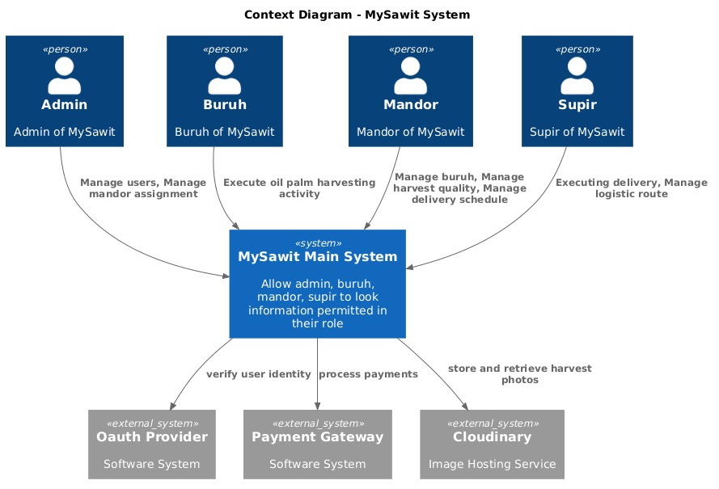

### Container Diagram
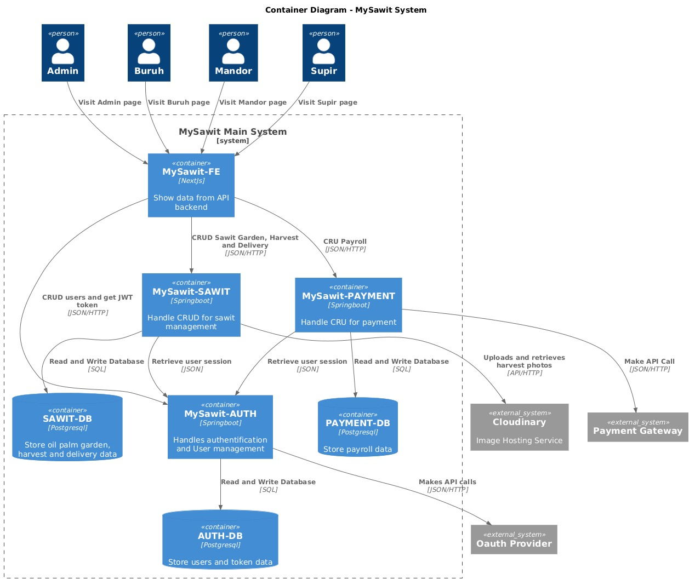

### Deployment Diagram
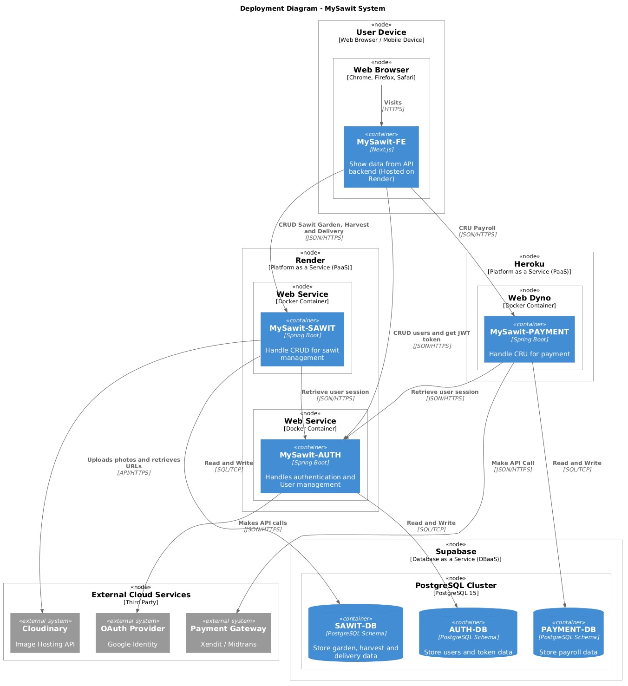

---
## 2. The Future Architecture
Based on our risk storming analysis, we modified the architecture by introducing a Message Broker (RabbitMQ) to decouple the services.

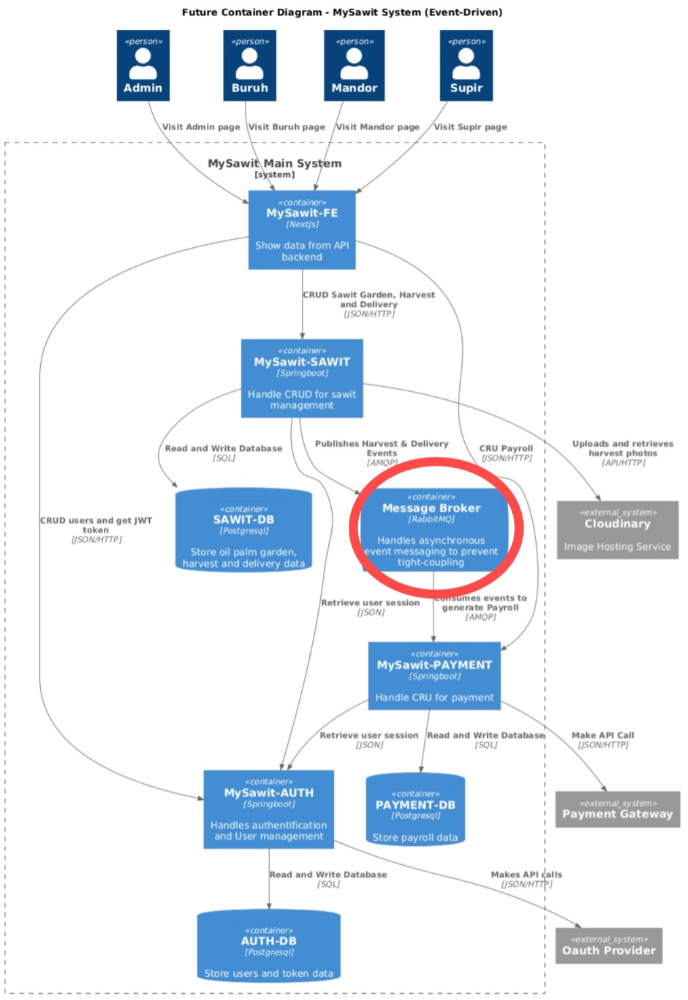

---
## 3. Explanation of Risk Storming

**Architectural Risk Analysis (Kondisi Saat Ini)**

Dalam arsitektur *microservices* MySawit saat ini, grup kami mengidentifikasi adanya risiko ketersediaan (*availability risk*) dan ketergantungan yang ketat (*tight-coupling*) antar Container. Contoh kasus utamanya terjadi pada alur bisnis inti: saat Mandor menyetujui panen di `MySawit-SAWIT`, sistem harus segera membuat data penggajian di `MySawit-PAYMENT`. Jika interaksi ini dilakukan secara sinkronus (Direct HTTP Call) dan `MySawit-PAYMENT` mengalami *downtime* atau *traffic overload*, maka operasi persetujuan panen di `MySawit-SAWIT` akan ikut gagal secara beruntun (*cascading failure*). Hal ini mengancam keandalan sistem secara keseluruhan.

**Architecture Modification Justification (Arsitektur Masa Depan)**

Untuk memitigasi risiko tersebut, kelompok kami sepakat memodifikasi arsitektur masa depan dengan menerapkan pendekatan **Event-Driven Architecture**. Kami menyisipkan *Container* baru berupa **Message Broker (RabbitMQ)** di pusat backend MySawit.

Dengan arsitektur masa depan ini, servis `SAWIT` tidak perlu lagi memanggil servis `PAYMENT` secara langsung. `SAWIT` cukup mengirimkan pesan/event (misal: *HarvestApprovedEvent*) ke RabbitMQ. Jika servis `PAYMENT` sedang bermasalah, pesan tersebut akan disimpan dengan aman di antrean RabbitMQ, dan baru akan diproses (*consumed*) saat servis `PAYMENT` kembali normal. Modifikasi ini memastikan *High Availability*, toleransi kesalahan (*fault tolerance*), dan pemisahan beban kerja yang sempurna bagi keseluruhan ekosistem MySawit.

---
## 4. Individual Works (Manajemen Kebun / Garden Management) - Amar Hakim

Berikut adalah **Component Diagram** dan **Code Diagrams** untuk bagian manajemen kebun (folder `garden`) yang saya kerjakan.

### Component Diagram
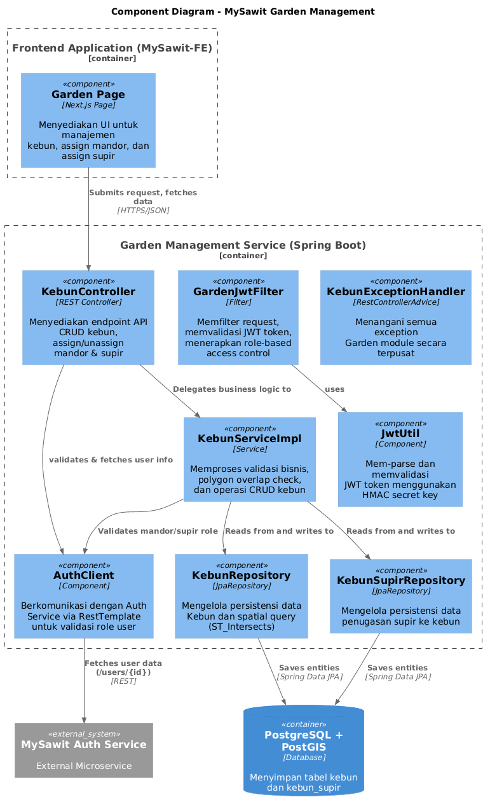

Diagram ini menunjukkan seluruh komponen dalam Garden Management Service beserta interaksinya dengan Frontend (MySawit-FE), Database (PostgreSQL + PostGIS), dan External Service (MySawit Auth Service).

### Code Diagrams
Diagram-diagram di bawah ini menunjukkan struktur class/interface di level kode dari modul Garden, dipisahkan berdasarkan layer:

1. **Code Diagram 1 — Domain Models & DTOs**: Menampilkan seluruh entity (`Kebun`, `KebunSupir`) dan DTO (`KebunCreateRequest`, `KebunUpdateRequest`, `KebunResponse`, `KebunDetailResponse`, `ApiResponse`, `AuthUserResponse`, dll.) beserta atribut lengkapnya.

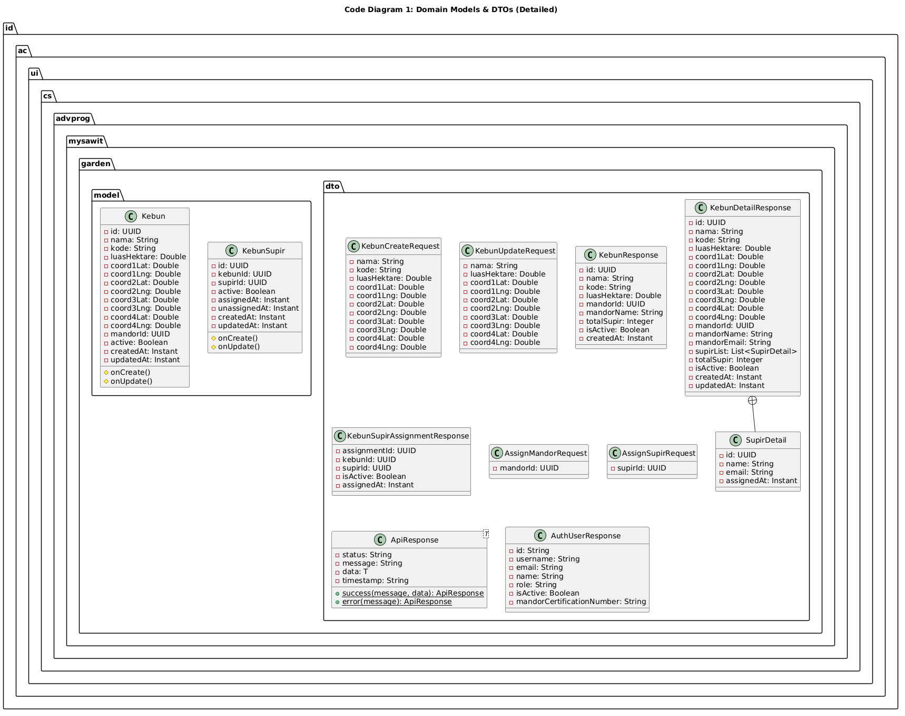

2. **Code Diagram 2 — Controller & Security Layer**: Menampilkan `KebunController` dengan semua endpoint REST-nya, `GardenJwtFilter` untuk autentikasi JWT dan role-based access control, `JwtUtil` untuk parsing token, dan `AuthClient` untuk komunikasi dengan Auth Service.

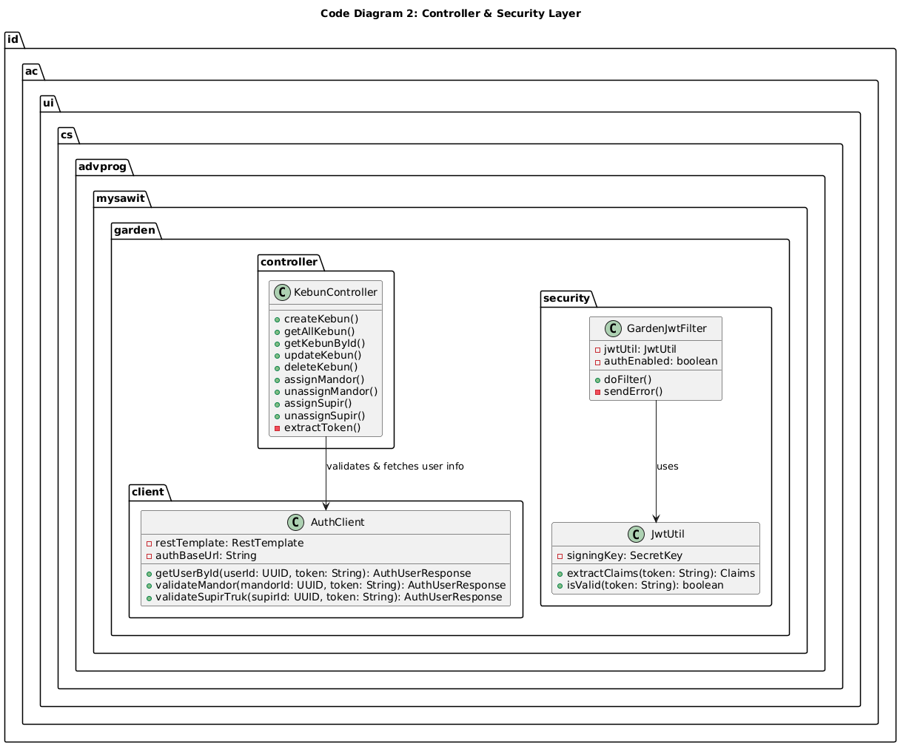

3. **Code Diagram 3 — Service & Repository Layer**: Menampilkan interface `KebunService`, implementasinya `KebunServiceImpl` dengan seluruh business logic (validasi polygon, overlap check, assign mandor/supir), `KebunRepository` dengan spatial query, `KebunSupirRepository`, dan `KebunExceptionHandler` untuk centralized error handling.

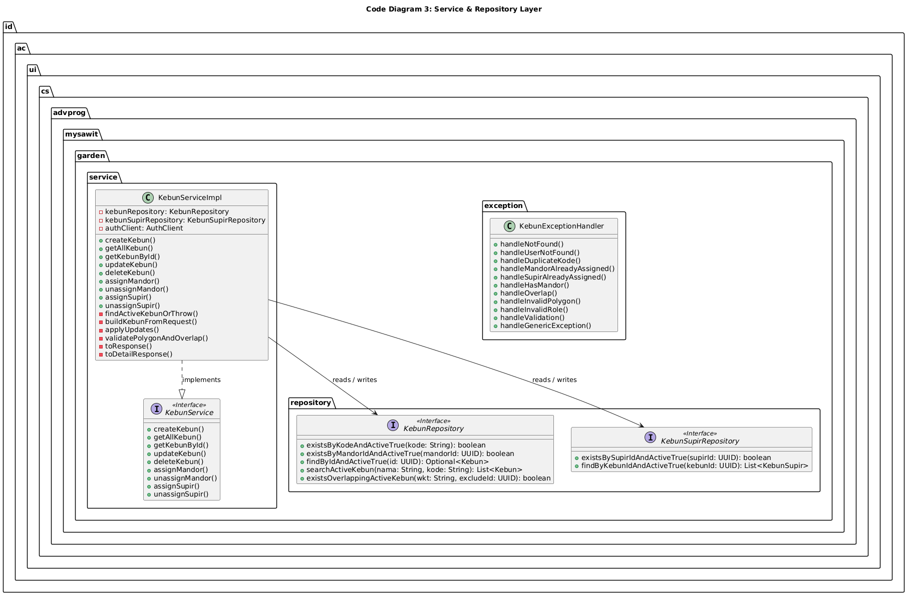

## 5. Individual Works (Manajemen Pembayaran / Payment Management) - Mirza

Berikut adalah **Component Diagram** dan **Code Diagrams** untuk bagian manajemen pembayaran (`MySawit-PAYMENT`) yang saya kerjakan.

### Component Diagram
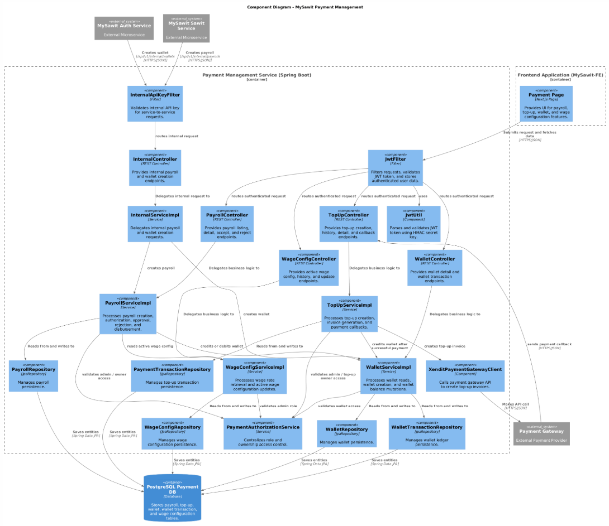

Diagram ini menunjukkan seluruh komponen dalam Payment Management Service beserta interaksinya dengan Frontend (MySawit-FE), Database (PostgreSQL Payment DB), External Service (Payment Gateway), serta internal service lain seperti MySawit Sawit Service dan MySawit Auth Service. Diagram ini juga menunjukkan alur internal API, yaitu Sawit Service membuat payroll melalui endpoint internal payment, dan Auth Service membuat wallet melalui endpoint internal payment.

### Code Diagrams
Diagram-diagram di bawah ini menunjukkan struktur class/interface di level kode dari modul Payment, dipisahkan berdasarkan fitur utama:

1. **Code Diagram 1 — Payroll Authorization & Approval**: Menampilkan `PayrollController`, interface `PayrollService`, implementasinya `PayrollServiceImpl`, `PaymentAuthorizationService`, `PayrollRepository`, `WalletService`, dan `WageConfigService`. Diagram ini menunjukkan bagaimana payroll dibuat, dilihat, diterima, atau ditolak dengan validasi akses berbasis role dan ownership.

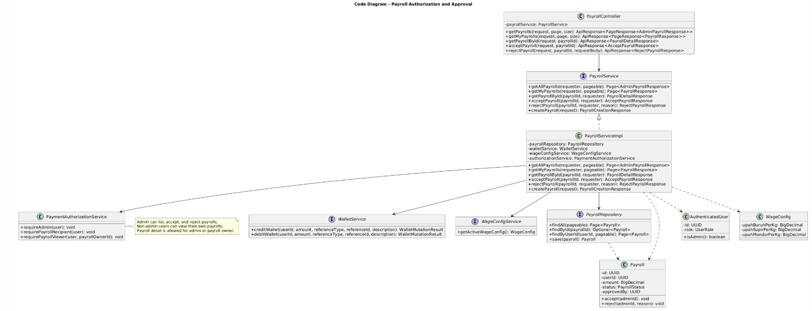

2. **Code Diagram 2 — Top-Up Authorization & Payment Gateway Flow**: Menampilkan `TopUpController`, interface `TopUpService`, implementasinya `TopUpServiceImpl`, `PaymentAuthorizationService`, `PaymentTransactionRepository`, `PaymentGatewayClient`, `XenditPaymentGatewayClient`, dan `WalletService`. Diagram ini menunjukkan alur pembuatan top-up, invoice payment gateway, callback pembayaran, dan update saldo wallet.

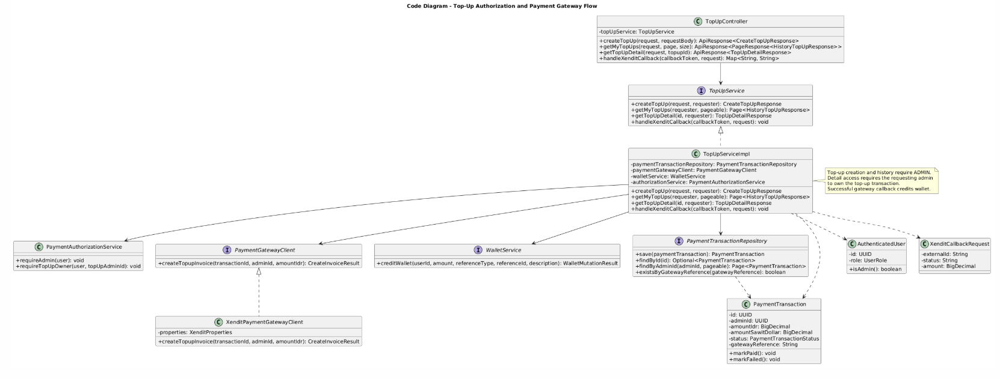

3. **Code Diagram 3 — Wallet Access & Ledger**: Menampilkan `WalletController`, interface `WalletService`, implementasinya `WalletServiceImpl`, `PaymentAuthorizationService`, `WalletRepository`, `WalletTransactionRepository`, entity `Wallet`, dan entity `WalletTransaction`. Diagram ini menunjukkan bagaimana akses wallet divalidasi dan bagaimana transaksi wallet dicatat sebagai ledger.

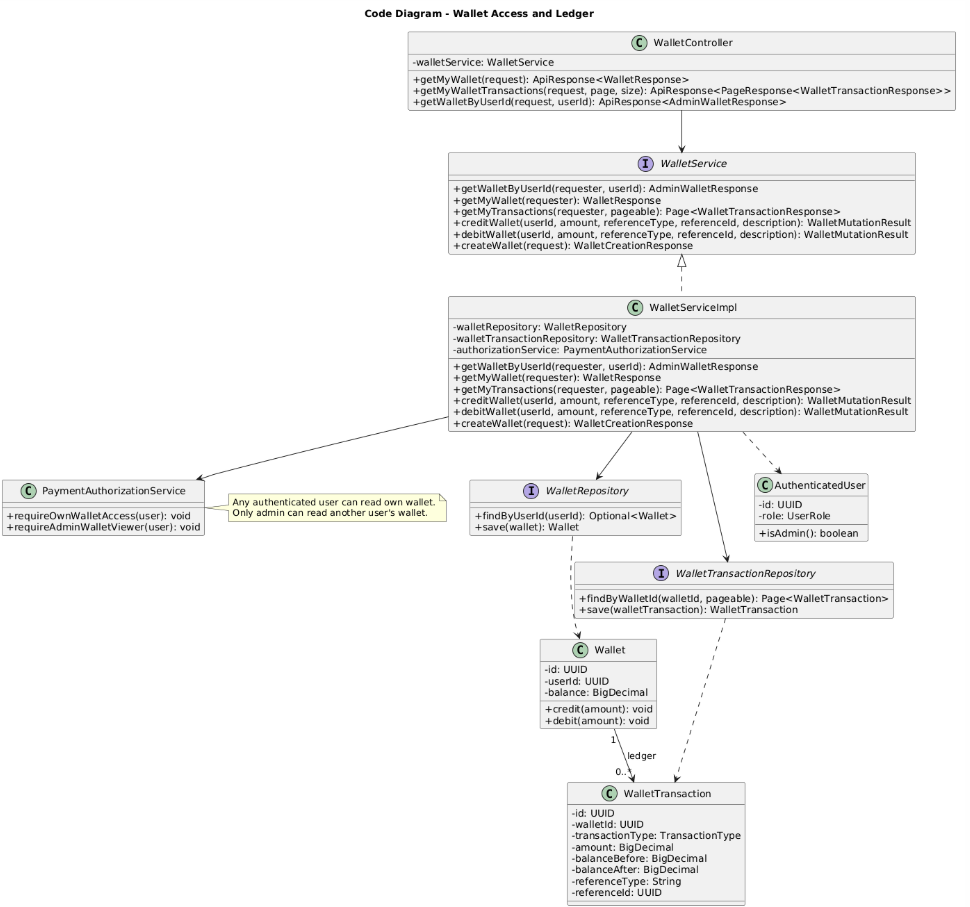

4. **Code Diagram 4 — Wage Configuration Management**: Menampilkan `WageConfigController`, interface `WageConfigService`, implementasinya `WageConfigServiceImpl`, `PaymentAuthorizationService`, `WageConfigRepository`, entity `WageConfig`, dan DTO `CreateWageConfigRequest`. Diagram ini menunjukkan bagaimana admin mengelola konfigurasi upah aktif, melihat riwayat konfigurasi, serta bagaimana konfigurasi lama dinonaktifkan ketika konfigurasi baru dibuat.

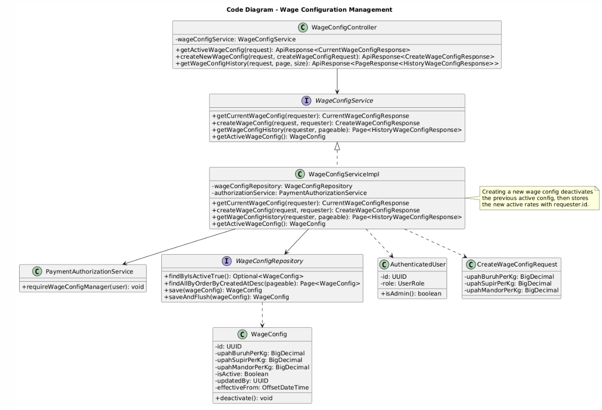
